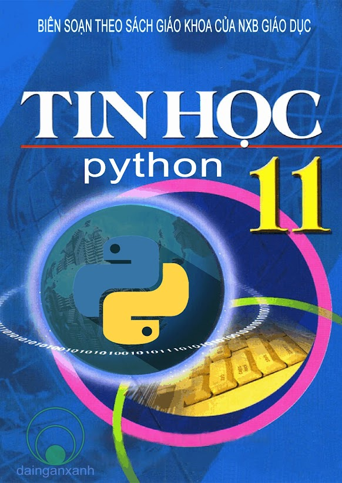
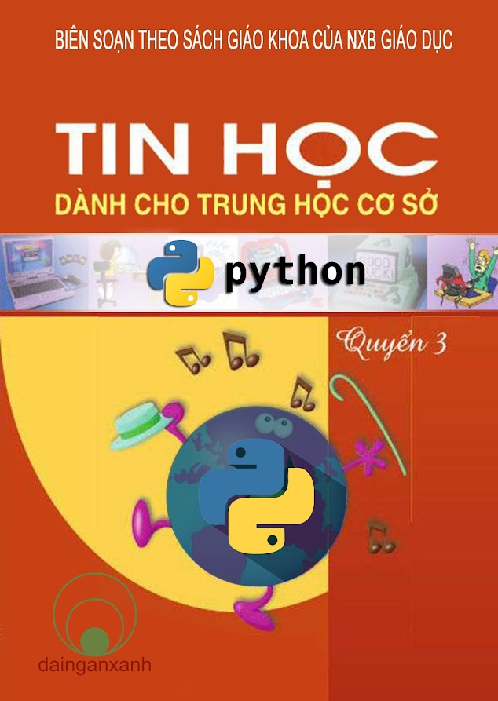

# Lời nói đầu

Giáo trình này là nội dung lược dịch từ khóa học Learn Python Programming được cung cấp bởi Programiz.  Về cơ bản, các bài học được giữ nguyên cấu trúc và nội dung kiến thức theo từng bài. Tuy nhiên, giáo trình có bổ sung một vài phần nhỏ, có thay đổi trình tự một vài chương mục hoặc bài học so với nguyên bản. Đặc biệt giáo trình có bổ sung các ví dụ, bài tập thực hành giúp người học tự kiểm tra và vận dụng kiến thức đã học.

Đây là tài liệu lược dịch, nhiều phần được diễn đạt lại chứ không dịch nguyên bản theo kiểu dịch thuật. Bạn đọc có thể tham khảo bản gốc tại [www.programiz.com/python-programming](https://www.programiz.com/python-programming) .

_@Dosing Project  
Contact: dainganxanh@msn.com_ 

## SÁCH THAM KHẢO

Thông tin chi tiến về 2 cuốn sách trên có tại: [https://dainganxanh.com/sgk\_python/](https://dainganxanh.com/sgk_python/)

