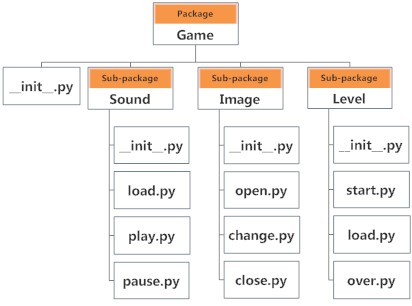

# Bài 20. Package

Package là thư mục chứa các module và các tệp dữ liệu khác. Thư mục được gọi là Package trong Python phải chứa tệp có tên \_\_init\_\_.py . Tệp này có thể là một tệp trống hoặc ta có thể đặt mã khởi tạo cho package đó.

Thư mục có thể chứa các thư mục con và tệp; tương tự như vậy, một Package có thể có các package con và các module.



## Sử dụng Package

Ta có thể nhập các module từ các package bằng toán tử dấu chấm \(.\). 

Ví dụ: nếu chúng ta muốn nhập module **start** sau đó gọi hàm select\_difficulty\(\) trong ví dụ trên, nó có thể được thực hiện như sau:

```python
import Game.Level.start
Game.Level.start.select_difficulty(2)
```

Cách khác, ta có thể viết lệnh gọi hàm ngắn hơn với phương thức import khác như sau:

```python
from Game.Level import start
start.select_difficulty(2)
```

Hoặc

```python
from Game.Level.start import select_difficulty
select_difficulty(2)
```


